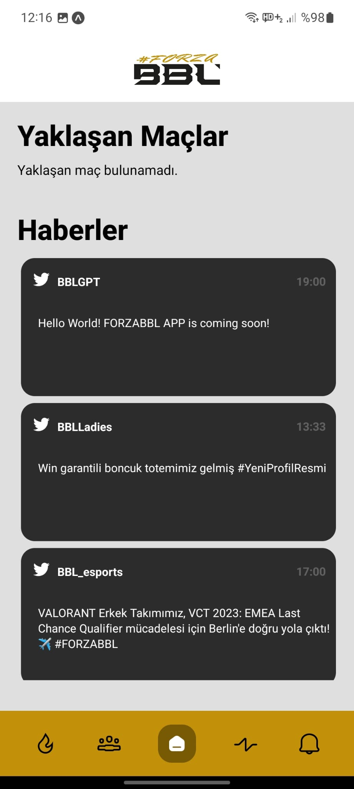
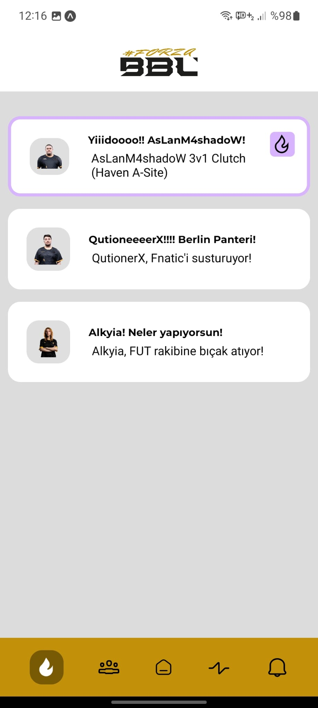
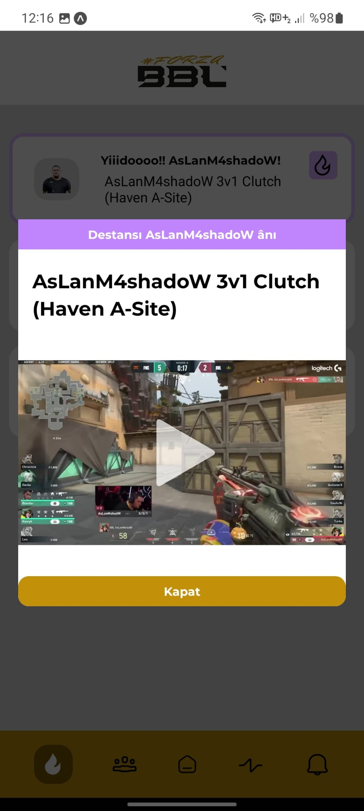
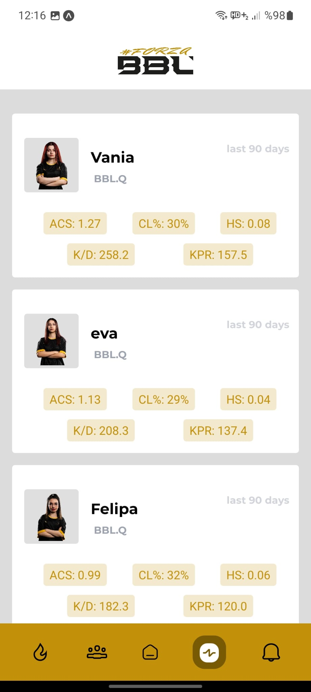
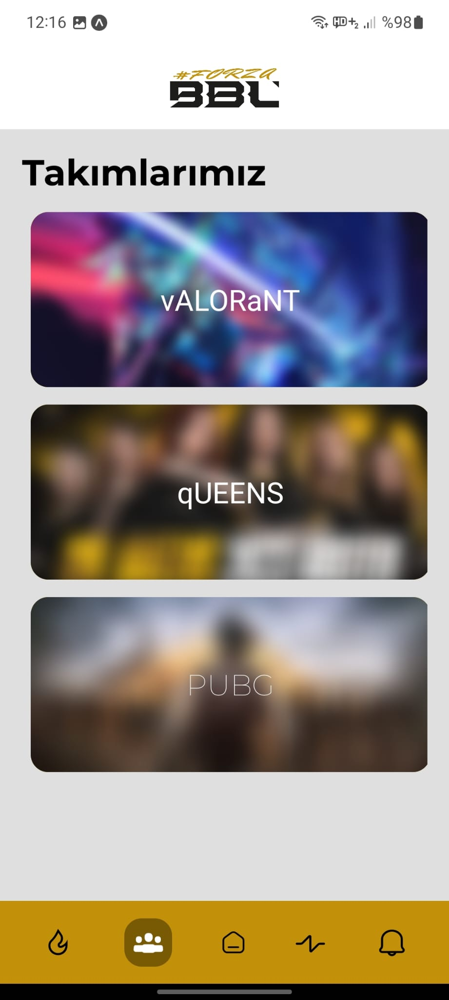

<h1 align="center">
  
    #FORZABBL
  
   
  Esports App for BBL Esports
</h1>

 

## `✨` What is this?
- ### This app is a **VALORANT Tournament App** written in **Expo** and **React-Native** and made for **__BBL Esports.__**
 In this application, which uses the **VLR.GG** infrastructure, you can find information about the **__BBL Esports__** team.

 

## `🧑‍💻` Screens

  <kbd>
    <h1 align="center" style="font-size: 36px"> Splash Screen  </h1> 
    
  </kbd>
  <kbd>
      <h1 align="center" style="font-size: 36px"> Main Screen  </h1> 
      
      
  </kbd>
  <kbd>
    <h1 align="center" style="font-size: 36px"> Best Moments Screen</h1> 
    
    
  </kbd>
  <kbd>
    <h1 align="center" style="font-size: 36px"> Statistics Screen</h1> 
    
  </kbd>
  <kbd>
    <h1 align="center" style="font-size: 36px"> Our Teams Screen</h1> 
    
  </kbd>
  <kbd>
    <h1 align="center" style="font-size: 36px">More will be added soon</h1>
  </kbd>

---

  
  Created, Designed, Developed by
  <a target="_blank" href="https://github.com/GweepCreative">
    Gürkan
  </a>
  

