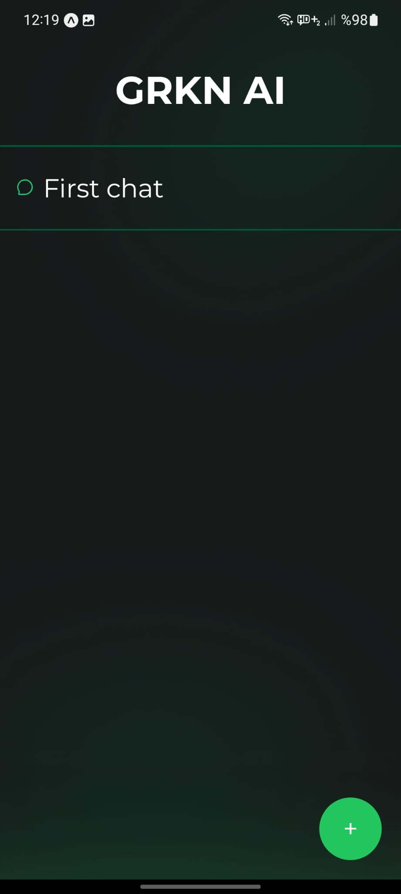
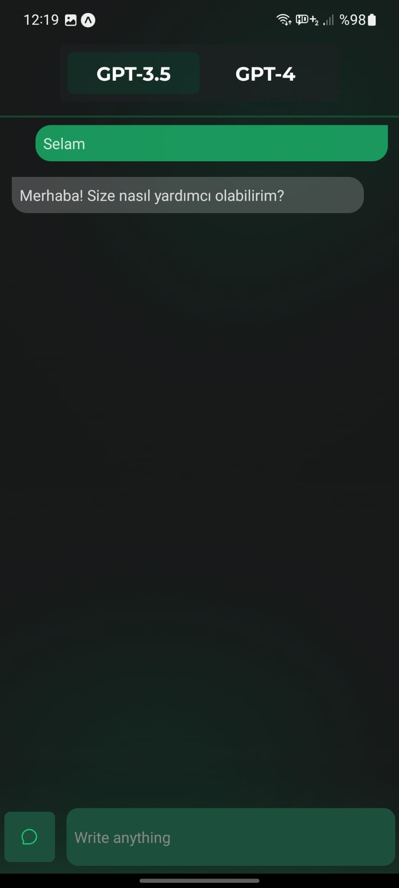

## `✨` What is this?
- ## Hello,
### this application is a **Chat App** application written in **Expo** and **React-Native**.
### In this application, which uses **OpenAI** infrastructure, you can access **ChatGPT-3.5** and **GPT 4** versions and set up chats.

 

## `🧑‍💻` Screens

  <kbd>
  
 Splash Screen
    
  

  </kbd>
    <kbd>
  
 Main Screen
    
  

</kbd>
  <kbd>
  
 Chat Screen
    
  

    </kbd>

---

 <a target="_blank" href="https://github.com/GweepCreative">Gürkan</a> tarafından Oluşturuldu, Tasarlandı, Geliştirildi.

