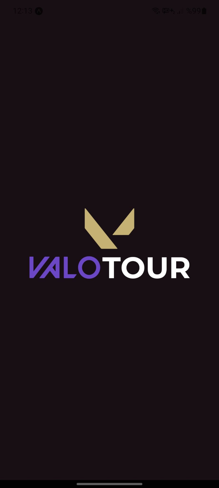
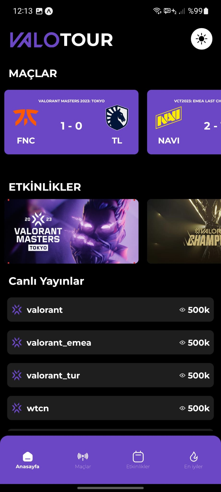
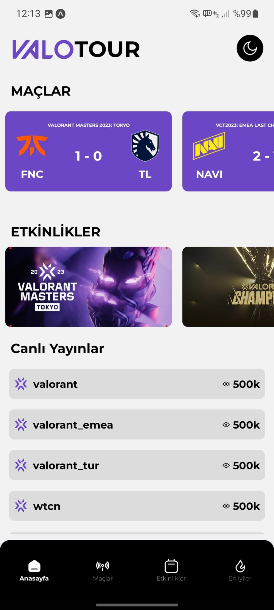
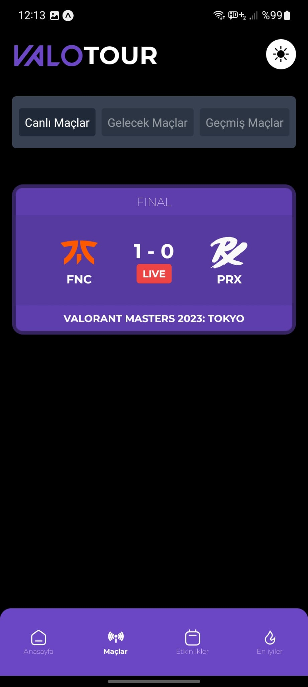
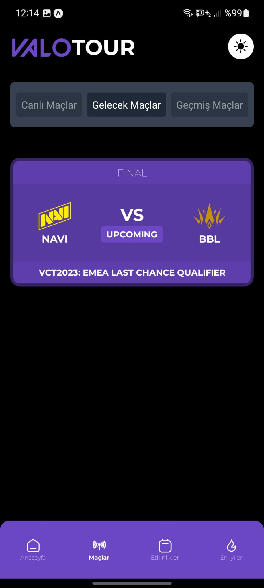
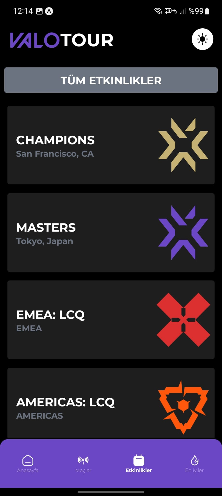
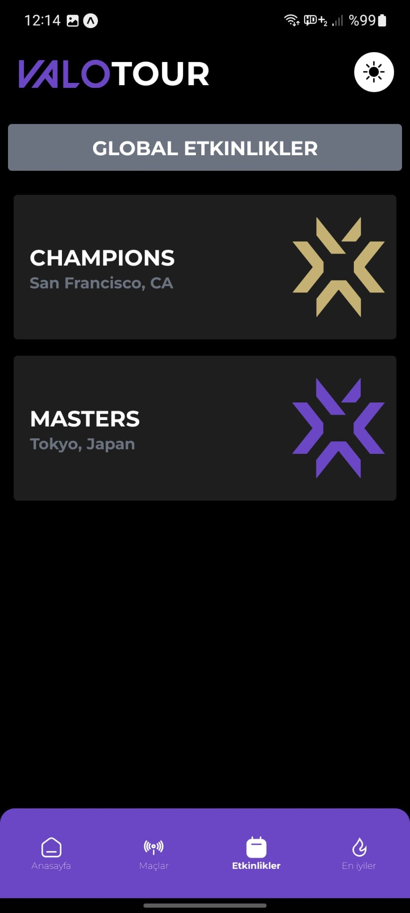
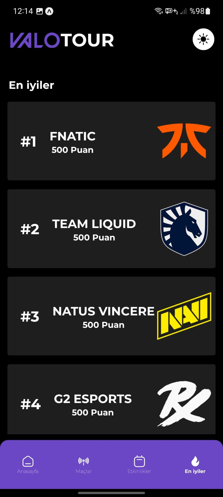

<h1 align="center">
  
    VLR
  
   
  VALORANT Tournaments App powered wtih VLR.GG API
</h1>

 

## `✨` What is this?
- ### this app is a **VALORANT Tournament App** written in **Expo** and **React-Native**.   You can access information about Tournaments in this application that uses **VLR.GG** infrastructure.
 

## `🧑‍💻` Screens

  <kbd>
    <h1 align="center" style="font-size: 36px"> Splash Screen  </h1> 
    
  </kbd>
  <kbd>
      <h1 align="center" style="font-size: 36px"> Main Screen  </h1> 
      
      
  </kbd>
   <kbd>
    <h1 align="center" style="font-size: 36px"> Matches Screen</h1> 
    
    
    
  </kbd>
  <kbd>
    <h1 align="center" style="font-size: 36px"> Events Screen</h1> 
    
    
    
  </kbd>
  <kbd>
    <h1 align="center" style="font-size: 36px"> BestOf Screen</h1> 
    
  </kbd>

---

  
  Created, Designed, Developed by
  <a target="_blank" href="https://github.com/GweepCreative">
    Gürkan
  </a>
  

